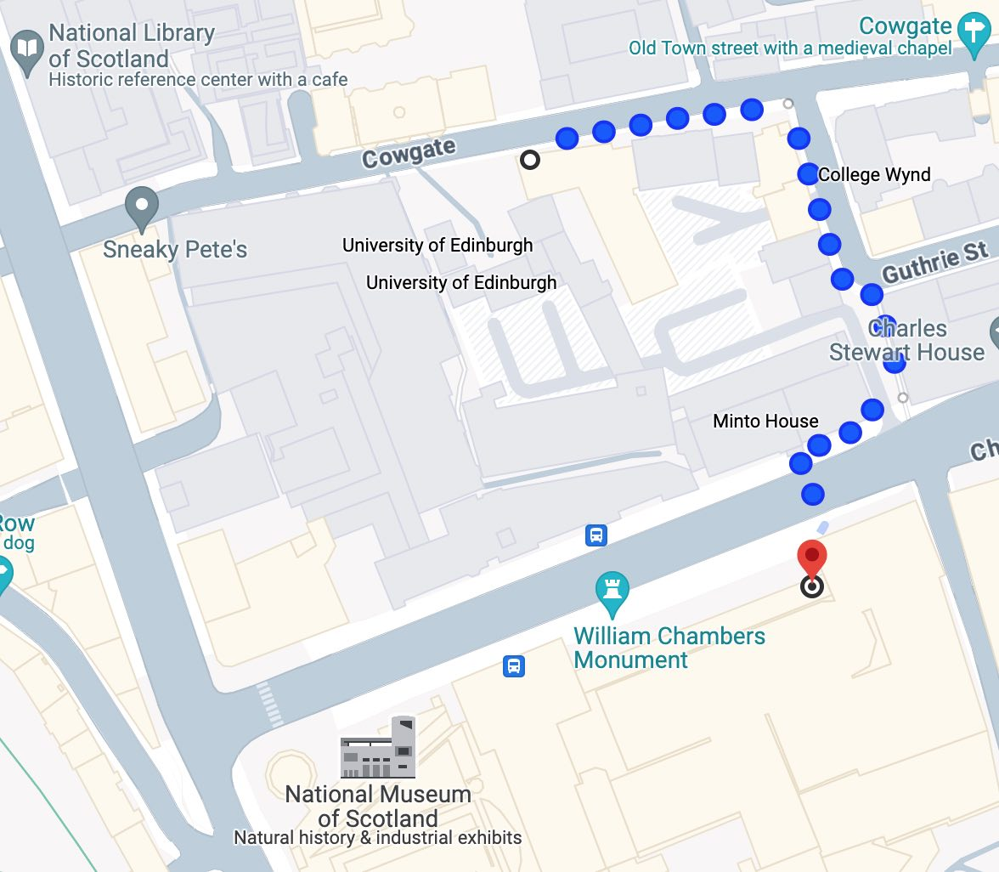

<!--

Timing
	Leave for museum  13:30
	Start share       15:30
	Finish            16:00

 T1 T2 T3 T4 T5 T6 T7 E
--> 

# Your mission 
_(should you choose to accept it)_

Please visit the National Museum of Scotland (aka _the museum of interesting things_). It's 5 mins walk from here.

Your mission is to:

- Find something interesting to bring back and chat about in the
pub
- (optionally) assess the impact of AI on the enjoyment of
experiences generally
- Share your opinions (what you think that means) with your colleagues

You might say using ChatGPT should be banned from quizzes, and you could be right. But what if it was mandatory?

**So up to you how you play** 

You can rush to the Museum, or you could rush to a café or pub, it's up to you to decide. Whatever you decide, it should be interesting to hear what you learn.

You have 2 hours from this briefing to complete the following tasks. Please get back to the Three Sisters pub by 15:30.

**Task 4 should happen at 15:00 at the latest**

## Task 1

Please send two volunteers from your team to the roof
terrace on the 7th floor. They should bring back the answer to this question:

> _What structure lies at bearing 337° from the viewing platform?_

## Task 2

Send half of your remaining team to the _"Art, Design and Fashion"_ galleries on level five.

They should bring back an example of where **design assumptions might lead to creating inaccessible** services or products.

1. What is the thing?
2. Why is it meaningful in accessibility terms?

## Task 3

Please send the other half of your team to the "Science and Technology" galleries. They will find hot air balloons. The balloons are tethered magnetically to their base. When the launch button turns red, clicking on it sends the balloon up to the roof

  - Why do you think they are tethered?
  - What would happen if they weren't?
  - How high did yours go?

## Task 4

**Regroup your team in one of two locations. Either the café in the basement next to the exit, or the "Balcony Café" (see map)**

Please all chip in and buy your two colleagues who went to the viewing platform a cake. Or two cakes. They have now walked the whole length of the museum and will need a boost to be able to tell the team about all things they have seen.

## Task 5

As a team (or two tables if your team is very large) please discuss the following question:

The Museum is filled with objects that are purely artistic, ethnographic or commercial. Have you seen an object today whose success could be described in terms of:

1. Why did people really like it, want it or buy it? (was it **desirable?** Why?)
2. How was the creation of this object technically **feasible** (was it cutting edge tech? A new use of old tech? A creative approach to a physical or mechanical problem?) Did tech cause its downfall?
3. If it was hard to make, either because it was large, or complex, or used rare materials etc, did it succeed (or fail) because it proved to be financially **viable**?

As an example, there is a fragment of a steel girder from the bridge _"over the silvery Tay"_ in the _"Industry and Empire"_ galleries. The story of that girder could be told in three chapters, following the themes above.

Please think of an object in the Museum and describe it in those terms.

## Task 6

As a team, please discuss the following question:

Something in this museum of interesting things was more interesting than the other things. Assuming you could have anything in the museum to take home with you, what would it be?

  1. What would your team take home with
them today?
  2. Why did you pick this thing?

## Task 7

Now, please agree what were the most interesting things overall and prepare your presentation. When your team comes back to the pub, you'll have 5 minutes to tell your colleagues what you experienced.

You can use the answers to the questions above as your interesting things or you can explore other things you saw...

As part of your presentation, if some of your team members used Google or ChatGPT to answer the questions, please include thoughts on how your team's experience of the task was impacted by AI (did it make it more fun? Less fun?).

_Please identify the three most interesting things that you experienced today_

  1. Thing one
  2. Thing two
  3. Thing three

## Extra credit questions 
_(no points but possibly fun?)_

1. what was the scariest thing you saw and why?

2. In the _"Animal Senses"_ gallery on level three, hanging from the ceiling is a creature that can both **swim faster than you, and run faster than you** (This creature would really struggle on a bicycle)
- What is this creature?

3. Can you take a photo of two team members with
the Scottish Widow?

4. Can you take a portrait of every team member
wearing a space suit?

5. Which Thunderbird spacecraft did Scott base his
monument on?

6. What was known as "Kissing the Maiden" in the 1600s?

Thanks!

	<a href="#your-mission">T</a>
	<a href="#task-1">T2</a>
	<a href="#task-4">T4</a>
	<a href="#task-6">T6</a>
	<a href="#task-7">T7</a>
	<a href="#extra-credit-questions">E</a>

